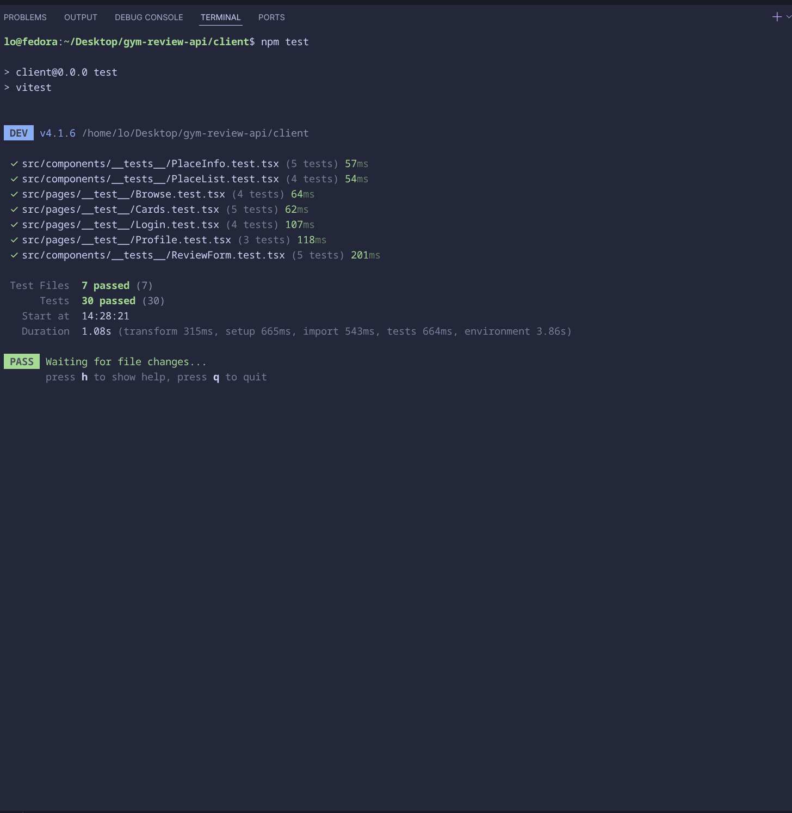
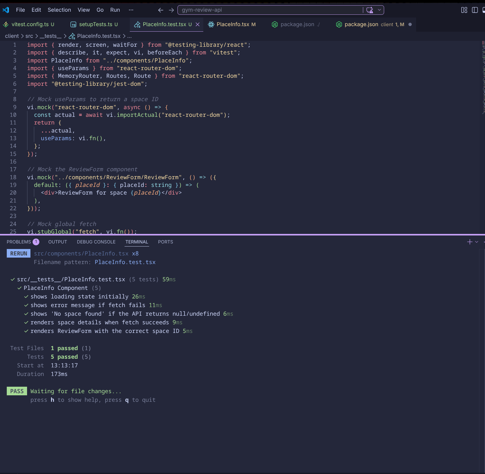
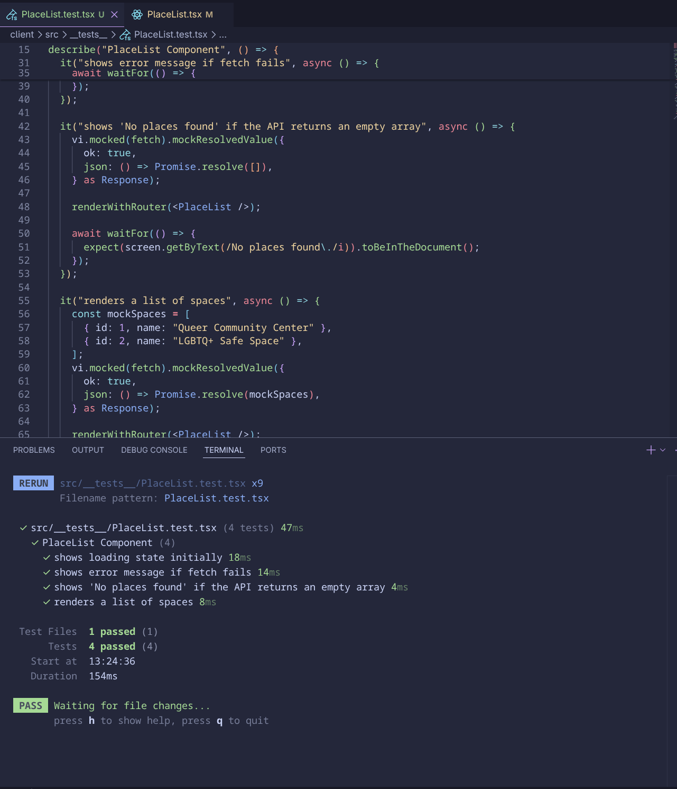
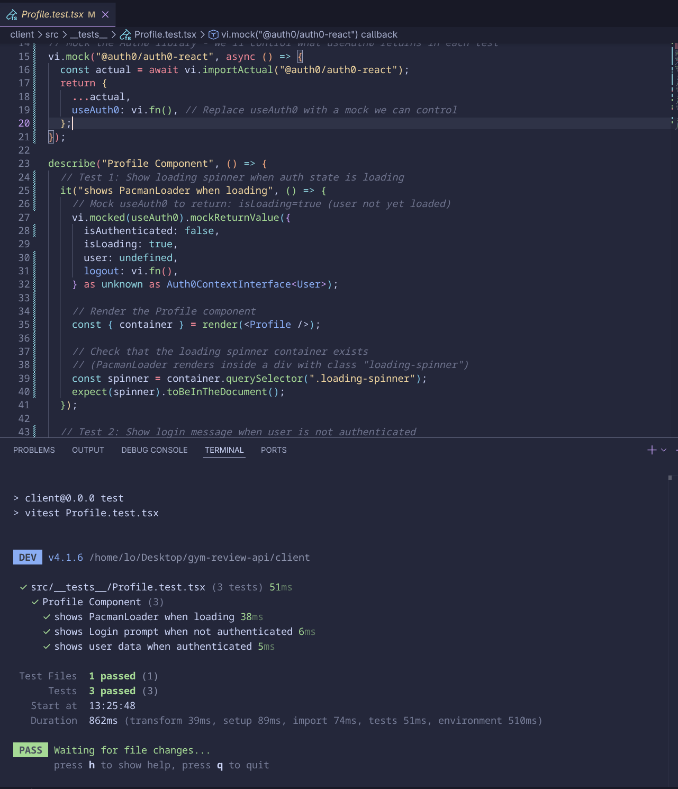
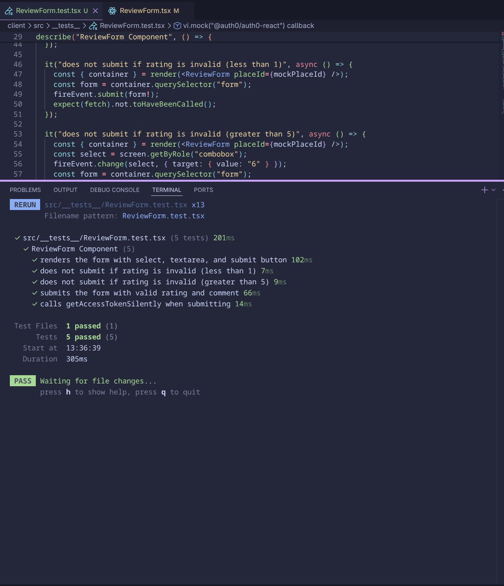
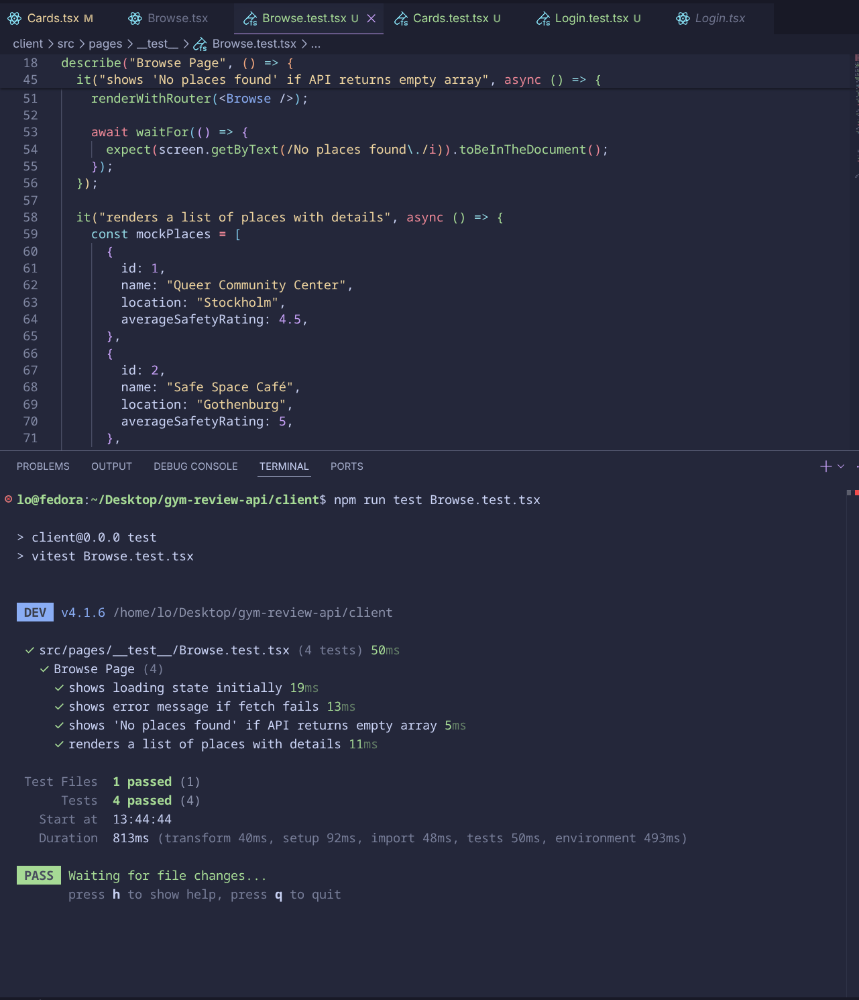
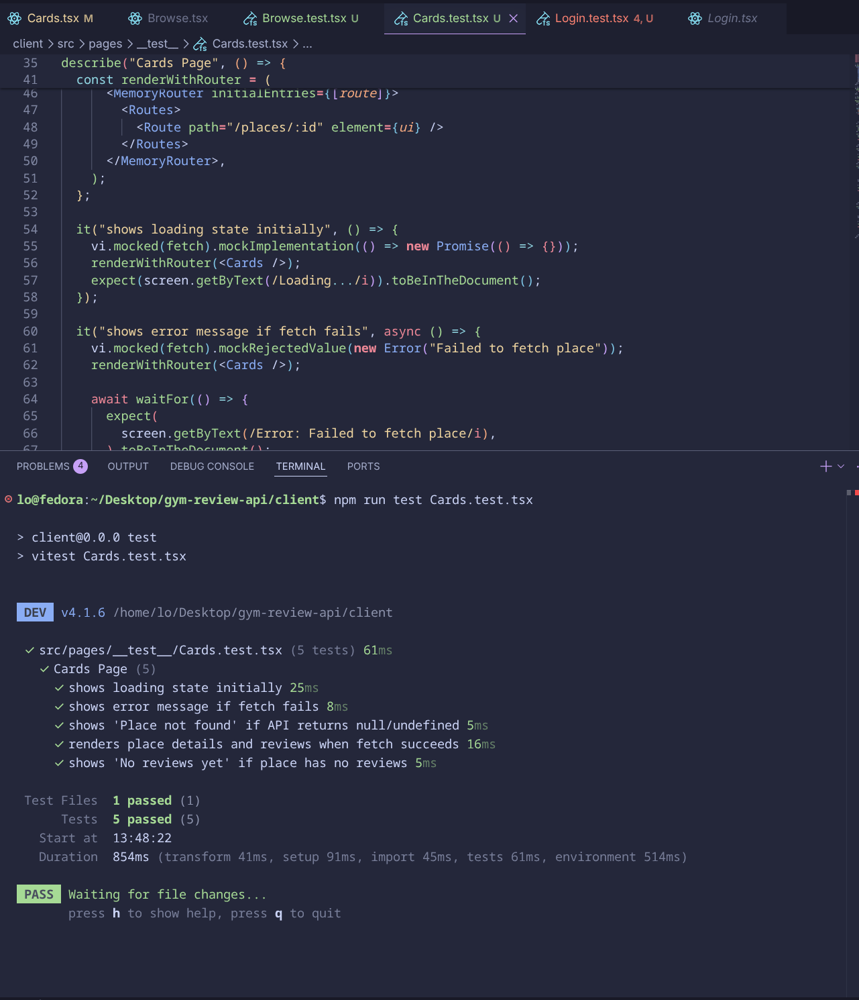
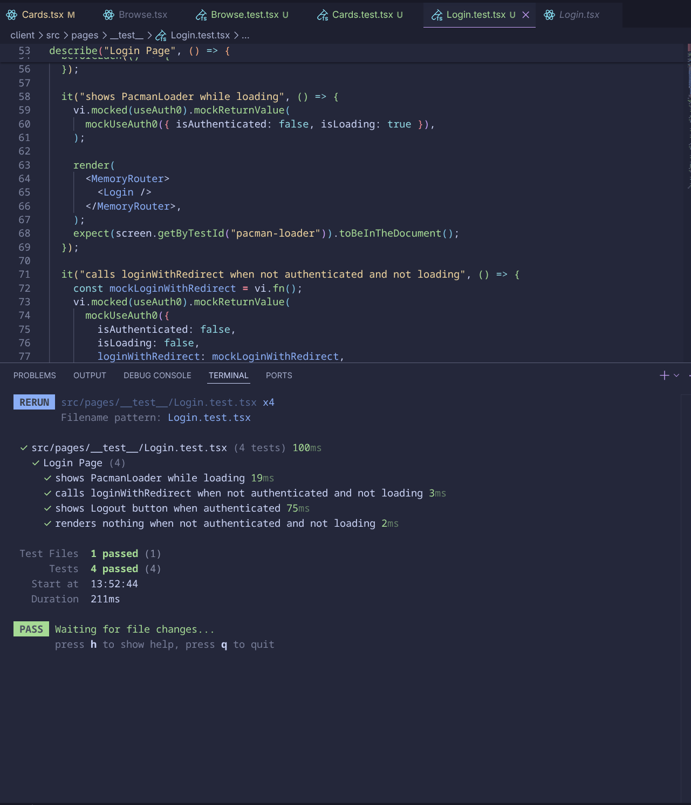
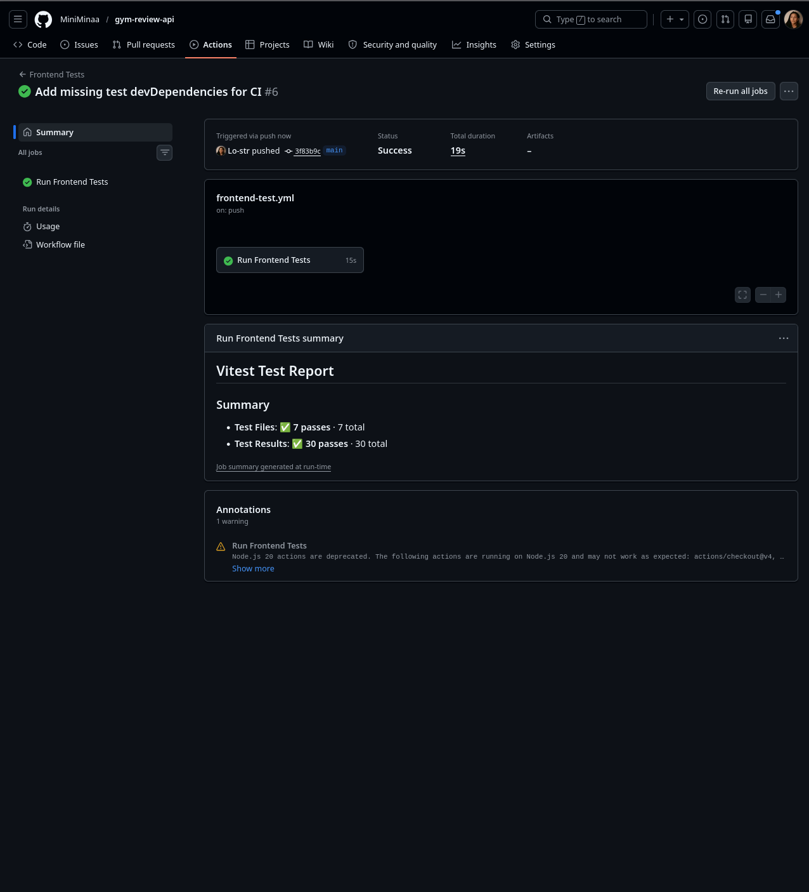

# Safe Space - Frontend Implementation

## Overview

This document outlines the frontend implementation for the **Safe Space** app, a Yelp-like platform for AFAB and queer individuals to rate and review spaces based on safety, inclusivity, and accessibility. This report focuses on the **Frontend + Testing + CI** responsibilities.

---

## Table of Contents

1. [Setup Instructions](#setup-instructions)
2. [Testing](#testing)
3. [Authentication](#authentication)
4. [Security Decisions](#security-decisions)
5. [Reflections](#reflections)
6. [Screenshots](#screenshots)

---

## Setup Instructions

1. Clone the repository:
   ```bash
   git clone <your-repo-url>
   cd client
   ```
2. Install dependencies:
   ```bash
   npm install
   ```
3. Set up a `.env` file in the `client` folder with the following Auth0 credentials (replace placeholders with your actual values):
   ```env
   VITE_AUTH0_DOMAIN=your-auth0-domain
   VITE_AUTH0_CLIENT_ID=your-client-id
   VITE_AUTH0_CALLBACK_URL=http://localhost:5173
   VITE_API_BASE_URL=http://localhost:4000
   ```

---

## Testing

### Running Tests Locally

To run all unit tests:

```bash
npm test
```

This will execute tests for:

- **Components**: `ReviewForm`, `PlaceList`, `PlaceInfo`
- **Pages**: `Browse`, `Cards`, `Login`, `Profile`

### Test Results

## All 30 tests passed.

## GitHub Actions

The project uses GitHub Actions to run tests automatically on push/pull requests.

- **Workflow File**: `.github/workflows/frontend-test.yml`
- **Steps**:
  1. Checkout repository.
  2. Set up Node.js (v20).
  3. Install dependencies (`npm install`).
  4. Run tests (`npm test`).

> **NOTE**: Add a screenshot of the GitHub Actions workflow passing (green checkmark).

---

## Authentication

This app uses **Auth0** for authentication.

### Auth0 Integration

- **Setup**:
  - `Auth0Provider` is configured in `App.tsx` with:
    - `domain`: Auth0 tenant domain
    - `clientId`: Auth0 client ID
    - `authorizationParams.redirectUri`: Callback URL: `http://localhost:5173`.

- **Components Using Auth0**:
  - `Login.tsx`: Uses `useAuth0()` to extract `loginWithRedirect`, `logout`, `isAuthenticated`, and `user`.
  - `Profile.tsx`: Displays user info (`user.name`, `user.email`) and logout button if `isAuthenticated` is true.

- **Conditional Rendering**:
  - Login/logout buttons and user info are conditionally rendered based on `isAuthenticated` and `isLoading`.

### Login/Logout Flow

- Unauthenticated users are redirected to the login page.
- Authenticated users can access protected routes (e.g., `/profile`).

### Protected Routes & Security Decisions

- **Protected Routes**: - `Profile` and `Login` are conditionally rendered based on `isAuthenticated`.
- **Token Handling**: Access tokens are obtained silently using `getAccessTokenSilently` for API calls.
- **Axios Configuration**: Uses `withCredentials: true` for secure API requests.

---

## Reflections

### Challenges

- Mocking Auth0 and its complex `Auth0ContextInterface` required careful setup to avoid type errors.
- Testing async behavior (e.g., fetch calls) required `waitFor` and proper mocking of `fetch` and Auth0.
- Ensuring all edge cases (e.g., empty states, network errors) were covered in tests.
- Auth0 consent issues and redirect URI mismatches.

### Improvements

- Add more edge-case tests (ex: malformed API responses).
- Implement integration tests for user flows (ex: submit a review → see it in the list).
- Better error handling and testing edge cases.
- Adding database and functionalities (ex: favorite space, tags, bio for user, facilitate social interaction through forums or posts sharing)

---

## Screenshots

> **Terminal Output**:

> 

> 

> 

> 

> 

> 

> 

> 

> - **GitHub Actions**:
>   
> - **UI Pages**:
>   - Home page (welcome message and CTA).
>   - Browse page (list of spaces).
>   - Place Details page (space info and reviews).
>   - Profile page (authenticated and unauthenticated states).
>   - Review Form (form for submitting reviews).
> - **Loading/Error States**:
>   - Loading spinners (e.g., PacmanLoader).
>   - Error messages for failed API calls.

---

## File Structure

```
src/
├── components/
│   ├── __tests__/
│   │   ├── ReviewForm.test.tsx
│   │   ├── PlaceInfo.test.tsx
│   │   └── PlaceList.test.tsx
│   ├── ReviewForm/
│   │   ├── ReviewForm.tsx
│   │   └── ReviewForm.css
│   ├── PlaceInfo/
│   │   ├── PlaceInfo.tsx
│   │   └── PlaceInfo.css
│   └── PlaceList/
│       ├── PlaceList.tsx
│       └── PlaceList.css
├── pages/
│   ├── __tests__/
│   │   ├── Browse.test.tsx
│   │   ├── Cards.test.tsx
│   │   ├── Login.test.tsx
│   │   └── Profile.test.tsx
│   ├── Browse/
│   │   ├── Browse.tsx
│   │   └── Browse.css
│   ├── Cards/
│   │   ├── Cards.tsx
│   │   └── Cards.css
│   ├── Login/
│   │   └── Login.tsx
│   ├── Profile/
│   │   ├── Profile.tsx
│   │   └── Profile.css
│   └── Home/
│       ├── Home.tsx
│       └── Home.css
├── App.tsx
├── main.tsx
└── .github/
    └── workflows/
        ├── Run-test.yml (backend)
        └── frontend-test.yml (frontend)
```
